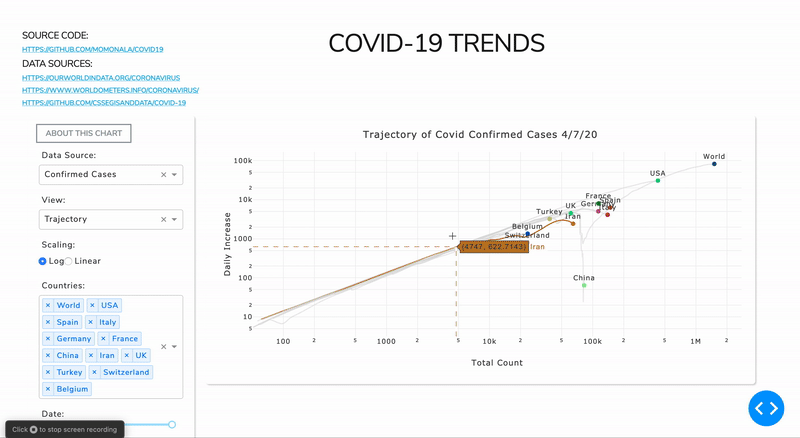
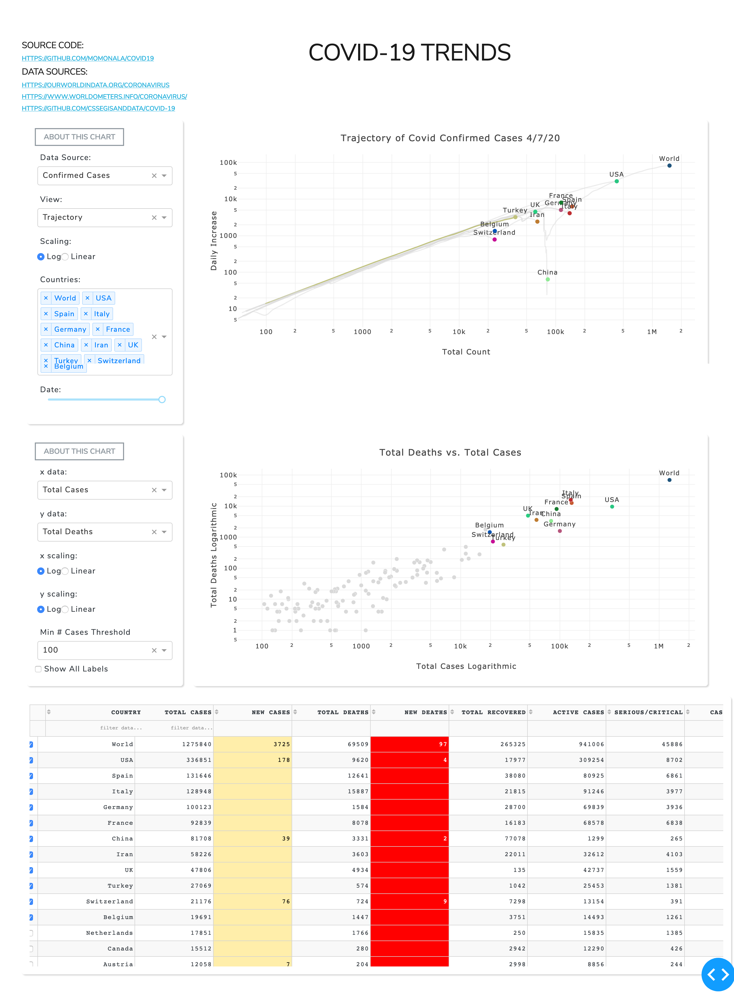

# Covid-19 Data Viewer

With open source tools from [Python Dash](https://plotly.com/dash/) and data from [worldometers.info](https://www.worldometers.info/) and [John's Hopkins University](https://github.com/CSSEGISandData/COVID-19), I've created an interactive web-app dashboard for Covid-19/Coronavirus time series and demographic data. 



Data Views include line and scatter plots, as well as the raw data table. All charts are interactive, with features such as hovering on lines and points for more data, zooming, scrolling, and selecting data features. Charts can be toggled between linear and exponential plotting, as well as cumulative, daily increase, trajectory, and "development since `x` number of cases" views.

### Installation

Requires Python 3.5+

```bash
pip install -r requirements.txt
python app.py
open http://127.0.0.1:8001/
```

To manually update and cache the worldometers.info data: 

`python -m model.worldometer`

### Directory structure

```bash
.
├── README.md
├── requirements.txt
├── app.py                    // the main app/controller
├── assets                    // CSS styling and "about" text files
│   ├── about.md
│   ├── about_line.md
│   ├── about_scatter.md
│   ├── favicon.ico
│   ├── s1.css
│   └── styles.css
├── model                    // all data and processing logic
│   ├── __init__.py
│   ├── country_iso.py
│   ├── cssegisand_data.py
│   ├── utils.py
│   ├── worldometer.py
│   └── worldometer_*.csv
└── view                     // the app layout/view
    ├── __init__.py
    ├── line_graph.py
    ├── scatter_plot.py
    ├── table.py
    ├── title.py
    └── utils.py

```

### Screenshots


### Known Issues

- units and general data is not available on hover of the line or scatter chart (only raw x, y values)
    - would like to have a uniform way for sending data into the Plotly plot objects (rather than iteratively and with a DataFrame.)

- zooming is auto-refreshed on hover for all charts
    - could be an issue with the way I'm handling hovering
